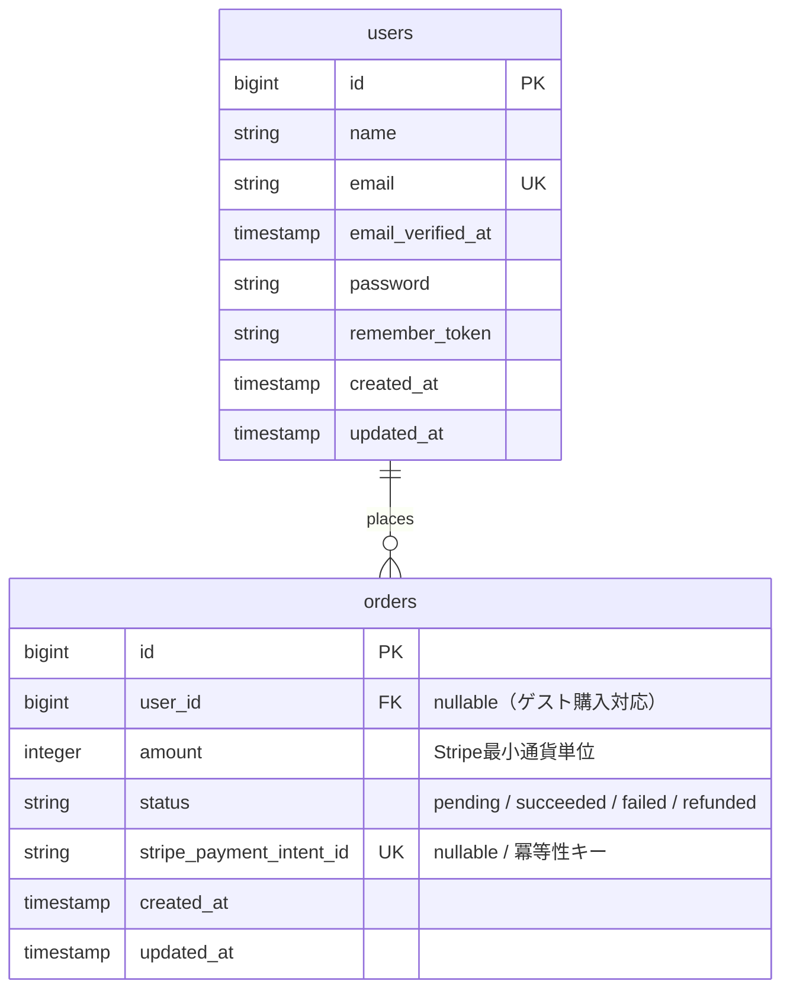
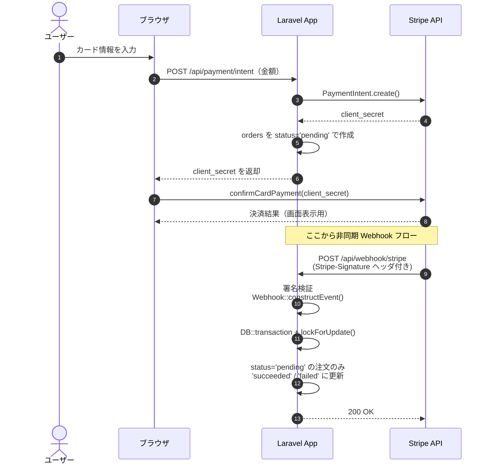
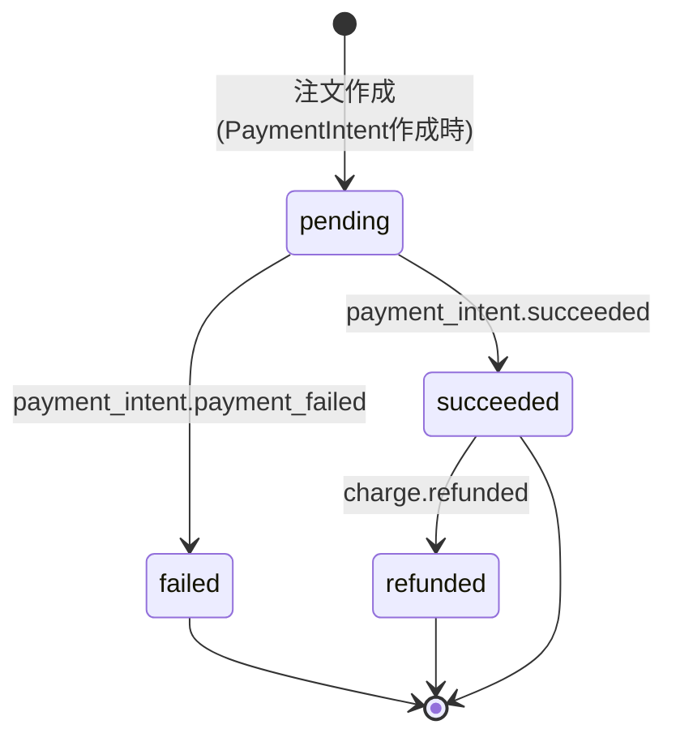
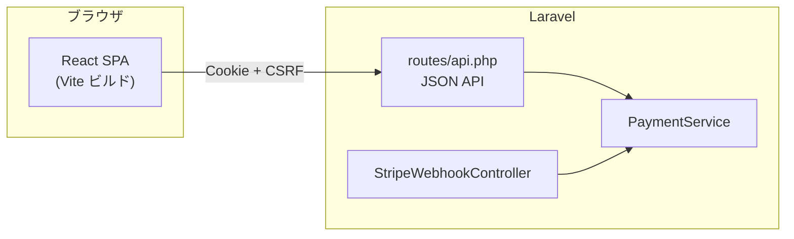

# laravel-payment-api

Laravel × Stripe Webhook による決済連携アプリケーションのポートフォリオ実装です。

ユーザーがログインしてカード決済を行い、Stripeからの Webhook を受け取って注文ステータスを更新する一連のフローを、実務を意識した設計で構築しています。

---

## ① 概要

Stripeの決済フローと Webhook 連携を実装した Laravel + React SPA アプリケーションです。
Laravel は JSON API と Webhook を、React は画面と Stripe.js を担当する構成です。
Brownfield 拡張として Blade SSR 版から React SPA 化し、開発プロセスは AI-DLC で記録しています（詳細は §⑨）。

開発は Cursor を使用。`.cursor/rules/` のポートフォリオ品質基準（不要なファイル・処理を足さない、README と実装の整合、Seeder で `make setup` 直後に再現）と README ガイド（共通章構成・Mermaid）に沿って実装している。

### 主な機能

- ユーザーログイン（セッション認証）
- Stripe を使ったカード決済フォーム
- Webhook 受信エンドポイント（`POST /api/webhook/stripe`）
- 署名検証による不正リクエストの検出・拒否
- 決済イベント（成功 / 失敗 / 返金）に応じた `orders` テーブルのステータス更新
- ログインユーザー本人の注文のみを表示する注文一覧画面

---

## ② 使用技術

| カテゴリ | 技術 |
|---|---|
| バックエンド | Laravel 13.x（PHP 8.4） |
| フロントエンド | React 19 + TypeScript + Vite + React Router + Tailwind CSS |
| 決済 | Stripe API（stripe/stripe-php v20.x、@stripe/stripe-js） |
| データベース | MySQL 8.0 |
| Web サーバー | Nginx 1.25 |
| コンテナ | Docker / Docker Compose |
| 認証 | Laravel Sanctum（SPA セッション認証） |

---

## ③ アーキテクチャ図

### ER図

ゲスト購入への拡張余地を持たせるため `orders.user_id` は nullable。
`stripe_payment_intent_id` に unique 制約を付けることで、Webhook 再送による二重登録をDBレベルで防止している。



### 決済フロー（シーケンス図）

ブラウザからの同期的な決済確認と、Stripe からの **非同期 Webhook** を分離した設計。
注文ステータスの確定は必ず Webhook 側で行うことで、ブラウザ側の通信断による状態不整合を防いでいる。



### 注文ステータスの状態遷移

`pending` → `succeeded` / `failed` への遷移は Webhook イベントによってのみ行われる。
`succeeded` から `refunded` への遷移は `charge.refunded` イベントで発生する。



---

## ④ 設計上の工夫

### セキュリティ

- **Webhook 署名検証の必須化**
  `Stripe\Webhook::constructEvent()` で署名を検証し、第三者による偽リクエストを防止。
  `SignatureVerificationException` を専用で捕捉し、署名検証失敗時のみ400を返すことで、想定外の例外を握りつぶさない設計にしている。

- **生のリクエストボディの取得**
  `$request->getContent()` で生バイト列を取得（内部的に `php://input` を読む）。
  パース済みの `$request->all()` ではStripeの署名検証が通らないため、Laravel流に統一しつつ正しい方法を選択。

- **機密情報の管理**
  API キー・Webhook シークレットはすべて `.env` で管理し、コードへの直接記述を禁止。
  `config()` 経由で参照することで `php artisan config:cache` 後も正しく動作するようにしている。

- **セッション固定攻撃対策**
  ログイン成功時に `session()->regenerate()` を呼び、セッションIDを再生成。
  ログアウト時には `invalidate()` でセッションを完全破棄。

### 冪等性・状態遷移

Stripeはネットワーク障害時にWebhookを再送するため、二重処理を防ぐ仕組みが必須。
本実装では3層で冪等性を担保している：

1. **`stripe_payment_intent_id` に unique 制約**
   同一PaymentIntentで2件目のレコード作成を物理的に防ぐ。

2. **状態遷移の条件付きUPDATE**
   `status = 'pending'` の注文のみを `succeeded` に更新する。
   既に処理済みの注文には何も起きないため、Webhookが何度来ても安全。

3. **`lockForUpdate()` によるレースコンディション対策**
   トランザクション内で行ロックを取得することで、同一イベントが並行して届いた場合でもDBレベルで直列化される。

```php
DB::transaction(function () use ($paymentIntent) {
    $order = Order::where('stripe_payment_intent_id', $paymentIntent->id)
        ->where('status', 'pending')
        ->lockForUpdate()
        ->first();

    if (!$order) return; // 処理済み or 対象なし

    $order->update(['status' => 'succeeded']);
});
```

### データ設計

- **金額を整数で保持**
  Stripeの仕様（最小通貨単位）に合わせ `amount` カラムを `integer` 型にすることで、浮動小数点誤差を排除。

- **`status` を string 型で保持**
  enum ではなく string にすることで、Stripeの新しいステータス（`requires_action`・`partially_refunded` など）にも柔軟に対応できる。

- **`stripe_payment_intent_id` で Stripe側と紐付け**
  Webhookで届く Stripe側のIDを保持することで、ダッシュボードとの照合・問い合わせ対応・冪等性チェックに活用。

- **拡張余地**
  状態遷移が複雑化した場合は `order_status_histories` テーブルを追加することで、変更履歴を監査可能な形で残せる設計を想定している。

### アーキテクチャ

- **Service層によるFat Controller回避**
  決済関連のビジネスロジック（DB操作・状態遷移・ロック制御）は `PaymentService` に集約。
  Controllerは「リクエスト受け取り・署名検証・イベント振り分け・レスポンス返却」のみを担う。

- **コンストラクタインジェクション**
  Laravelの DIコンテナを利用し、Controller に Service を注入。
  テスト時にモック差し替えが可能な構成。

- **`match` 式によるイベント振り分け**
  Stripeのイベント種別に応じてService のメソッドを呼び分ける処理を `match` で簡潔に表現。

- **Docker でのインフラ隔離**
  app / web / db を専用ネットワーク（`laravel_network`）で隔離し、外部からの直接DBアクセスを防止。

---

## ⑤ ローカル起動方法

### 前提条件
- Docker Desktop がインストール済みであること
- Node.js がインストール済みであること（フロントビルドはホスト側で実行）
- Stripe アカウントを持っていること（テストモードでOK）
- `make` が利用できること（Windows は Git Bash / WSL2 を推奨）

### 手順

**1. リポジトリのクローン**
```bash
git clone <リポジトリURL>
cd laravel-payment-api
```

**2. 一括セットアップ**

コンテナ起動・依存インストール・マイグレーション・シーディング・フロントビルドまでを一括で実行します。
```bash
make setup
```

`make setup` 直後に `test@example.com` / `password123` でログインできる状態になります。

**3. Stripe キーの設定**

`src/.env` を編集して Stripe のキーを設定します（`make setup` で `.env` は自動生成済み）：

```env
STRIPE_SECRET_KEY=sk_test_xxxxxxxxxx     # Stripe Dashboard から取得
STRIPE_PUBLIC_KEY=pk_test_xxxxxxxxxx
STRIPE_WEBHOOK_SECRET=whsec_xxxxxxxxxx   # Webhook 設定後に取得
```

> 主な `make` コマンドは `make help` で一覧できます。
> 個別実行する場合は `make up` / `make migrate` / `make seed` / `make build`、データをまっさらに戻す場合は `make fresh` を使用します。

**4. 動作確認**

ブラウザで `http://localhost` にアクセスすると `/login` にリダイレクトされます。
以下の認証情報でログインしてください：

| 項目 | 値 |
|---|---|
| メールアドレス | `test@example.com` |
| パスワード | `password123` |

ログイン後、決済フォーム（`/payment`）と注文一覧（`/orders`）が利用できます。

---

## ⑥ 動作確認

### Stripe テスト用カード番号

| カード番号 | 結果 |
|---|---|
| `4242 4242 4242 4242` | 決済成功 |
| `4000 0000 0000 0002` | 決済失敗 |
| `4000 0025 0000 3155` | 3Dセキュア認証あり |

- 有効期限：未来の日付ならなんでもOK（例：`12/30`）
- CVC：任意の3桁（例：`123`）

### Webhook のローカル受信

決済後に注文ステータスを `succeeded` に更新するには、**決済前に** Stripe CLI で Webhook 転送を起動してください。

[Stripe CLI](https://stripe.com/docs/stripe-cli) を使ってローカルで Webhook を受信できます：

```bash
# 1. Stripe CLI でイベントを localhost に転送（先に起動）
stripe listen --forward-to localhost/api/webhook/stripe

# 2. 表示された whsec_... を src/.env の STRIPE_WEBHOOK_SECRET に設定

# 3. ブラウザで決済 → 注文一覧で「再取得」

# 手動でテストイベントを送る場合
stripe trigger payment_intent.succeeded
```

### テスト実行

```bash
make test
```

### コンテナの停止

```bash
make down
```

---

## ⑦ ディレクトリ構成

```
laravel-payment-api/
├── docker/
│   ├── nginx/
│   │   └── default.conf
│   └── php/
│       └── Dockerfile
├── src/                                              # Laravel + React SPA
│   ├── app/
│   │   ├── Http/Controllers/
│   │   │   ├── AuthApiController.php                 # 認証 JSON API
│   │   │   ├── PaymentApiController.php              # PaymentIntent 作成 API
│   │   │   ├── OrderApiController.php                # 注文一覧 API
│   │   │   ├── ConfigApiController.php               # Stripe 公開キー API
│   │   │   └── StripeWebhookController.php           # Webhook 受信・署名検証
│   │   ├── Models/
│   │   │   ├── User.php
│   │   │   └── Order.php
│   │   └── Services/
│   │       └── PaymentService.php                    # 決済ビジネスロジック・冪等性制御
│   ├── resources/
│   │   ├── js/                                       # React SPA
│   │   │   ├── pages/                                # Login, Payment, Orders 等
│   │   │   ├── components/                           # AuthGuard, Layout
│   │   │   ├── hooks/useAuth.tsx
│   │   │   └── api/client.ts
│   │   └── views/
│   │       └── app.blade.php                         # SPA シェル
│   ├── routes/
│   │   ├── web.php                                   # SPA フォールバック
│   │   └── api.php                                   # JSON API + Webhook
│   └── tests/Feature/                                # API / Webhook テスト
├── aidlc-docs/                                       # AI-DLC 成果物（面談で画面共有）
├── docker-compose.yml
├── Makefile                                          # セットアップ・運用コマンド集約
└── README.md
```

---

## ⑨ React SPA 化 + AI-DLC（Brownfield 拡張）

既存の Blade SSR 版を **React SPA + JSON API** に刷新した拡張フェーズの記録です。
決済中核（`PaymentService`・Webhook・冪等性）は維持し、変更はプレゼンテーション層と API 契約に限定しています。

開発は **AI-DLC**（awslabs/aidlc-workflows）を Brownfield パターンで適用。Inception で既存コードを Reverse Engineering し、要件・設計を `aidlc-docs/` に残してから Construction で 5 Unit に分けて実装しました。

### Before / After

| 観点 | Before（Blade SSR） | After（React SPA） |
|---|---|---|
| フロント | Blade テンプレート + インライン JS | React 19 + TypeScript + Vite + React Router |
| ルーティング | Laravel `web.php` | クライアントルーティング（`AuthGuard` で保護） |
| 認証 | セッション（フォーム POST） | Sanctum SPA（Cookie + CSRF） |
| バックエンド | Controller が HTML 返却 | JSON API（`routes/api.php`） |
| 決済中核 | `PaymentService` / Webhook | **変更なし**（署名検証・冪等性を維持） |
| 配信 | Blade ビュー | `app.blade.php` を SPA シェルにし、Vite ビルド成果物を配信 |

### なぜ SPA 分離か

- **保守性**: 画面ロジックを Laravel から切り離し、フロント単体で改修できる
- **API 境界の明確化**: 決済・注文の契約を JSON API に固定し、将来のモバイル対応にも転用可能
- **Brownfield の原則**: 動いている Webhook・冪等性ロジックは触らず、リスクの高い領域を変更しない

### AI-DLC で使った工程

| フェーズ | 成果物（`aidlc-docs/`） | 自分が判断したこと |
|---|---|---|
| Reverse Engineering | `inception/reverse-engineering/` | 既存 Blade 構成・触ってはいけない中核の特定 |
| Requirements | `inception/requirements/requirements.md` | Sanctum SPA 採用、Webhook 維持、拡張機能（Security Baseline 等）は No |
| Application Design | `inception/application-design/` | API エンドポイント一覧、SPA コンポーネント分割 |
| Construction | `construction/plans/u1〜u5-*.md` | Unit 順序（認証 → SPA 基盤 → 決済 API → 画面 → テスト） |

面談での画面共有導線は [`aidlc-docs/README.md`](aidlc-docs/README.md) を参照。

### SPA アーキテクチャ

Laravel は JSON API と Webhook に専念し、React が画面と Stripe.js を担当する。認証は同一オリジン上の Sanctum SPA パターン。



### 面談版（1分）— トークH

1. **何を作ったか（15秒）**  
   既存の Laravel 決済アプリを Brownfield で React SPA 化しました。Blade のサーバーサイドレンダリングから、React + JSON API + Sanctum SPA 認証に刷新しています。

2. **設計上の工夫（30秒）**  
   AI-DLC の Inception で既存コードを Reverse Engineering し、決済中核の `PaymentService` と Webhook は触らない方針を先に固定しました。API 境界を `routes/api.php` に集約し、フロントは React Router でクライアントルーティング。承認ゲートごとに `aidlc-docs/` に判断を残し、Never Vibe Code で実装しています。

3. **実務との接続（15秒）**  
   現場でも「壊れている部分だけ直す」Brownfield が多いです。未習熟の React でも、設計をドキュメントに落としてから AI 駆動で実装すれば、初見技術でも実務品質に到達できる、という再現性のある強みを示しています。

---

## ⑩ Cursor Rules（テックリード訴求）

`.cursor/rules/` にチーム品質基準を定義し、AI 生成コードのレビュー負荷を下げる運用を実践しています。

| Rule | 内容 | 面談での語り |
|---|---|---|
| `service-layer.mdc` | Controller 薄く・Service に集約 | 「ロジック散在を Rule で防ぐ」 |
| `transaction-boundary.mdc` | Tx 内更新・lockForUpdate・dispatch は Tx 外 | 「決済のレース対策を規約化」 |
| `test-conventions.mdc` | Feature テスト・Stripe モック・命名規約 | 「AI 生成にも認証/冪等性テストが付く」 |

### 面談版（1分）— トークC 素材

1. **何をしたか（15秒）**  
   `.cursor/rules/` に Service 層・トランザクション境界・テスト規約を定義し、AI 駆動開発時の品質底上げに使っています。

2. **Before/After（30秒）**  
   Rule 導入前は AI が Controller にロジックを直書きしがちでした。Rule 適用後は Service 層への抽出と Feature テスト付与がデフォルトになり、セルフレビューの指摘箇所が減りました。

3. **実務との接続（15秒）**  
   テックリードとして「Rule を書く → ジュニアの AI 生成コードの品質が上がる → レビュー負荷が下がる」という流れをチームに展開できる、と語れます。

---

## ⑧ 今後の拡張案

- **キュー（Job）化**
  Webhook 受信時の処理を `ProcessPaymentSucceeded` などの Job に切り出し、即座に200を返してワーカーで非同期処理する設計に拡張可能。
  メール送信・在庫更新など重い処理を追加する際に Stripe のタイムアウト（30秒）を回避できる。

- **状態遷移履歴の保存**
  `order_status_histories` テーブルを追加し、ステータス変更履歴を監査可能な形で記録する。
  チャージバック・部分返金など複雑な状態遷移が必要になった際に有効。

- **失敗ジョブの監視**
  `failed_jobs` テーブルを活用し、リトライ上限超過時に Slack通知などで担当者にアラートを飛ばす仕組み。
