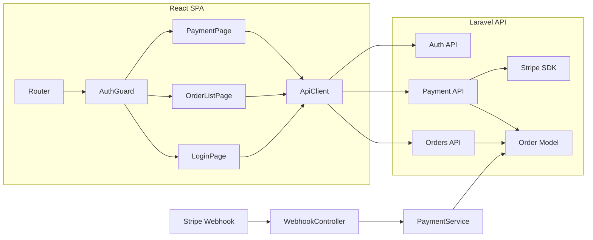

# Component Dependencies — React SPA 化

## Dependency Matrix

| From | To | Type | Notes |
|---|---|---|---|
| LoginPage | ApiClient | uses | CSRF + login API |
| AuthGuard | ApiClient | uses | fetchUser, 401 検知 |
| PaymentPage | ApiClient | uses | intent API |
| PaymentPage | Stripe.js | external | カード決済（CDN） |
| OrderListPage | ApiClient | uses | orders API |
| Layout | ApiClient | uses | logout |
| PaymentApiController | Stripe SDK | external | PaymentIntent.create |
| PaymentApiController | Order model | uses | pending 作成 |
| OrderApiController | Order model | uses | 本人の注文のみ |
| StripeWebhookController | PaymentService | DI | イベント処理 |
| PaymentService | Order model | uses | 状態遷移 |
| ApiClient | Sanctum | framework | CSRF cookie |
| AuthApiController | Laravel Auth | framework | attempt / logout |

## Data Flow



## Communication Patterns
- **SPA ↔ API**: REST JSON、同一オリジン、Cookie 認証（Sanctum SPA）
- **API ↔ Stripe**: サーバー SDK（シークレットキー）
- **Browser ↔ Stripe**: Stripe.js（公開キー、カード情報は直接）
- **Stripe ↔ API**: Webhook（署名検証、生ボディ）

## Text Alternative
```
React (ApiClient) → Laravel JSON API → Eloquent / Stripe SDK
Stripe → Webhook → PaymentService → Order
React (Stripe.js) → Stripe API（カード決済のみ）
```
