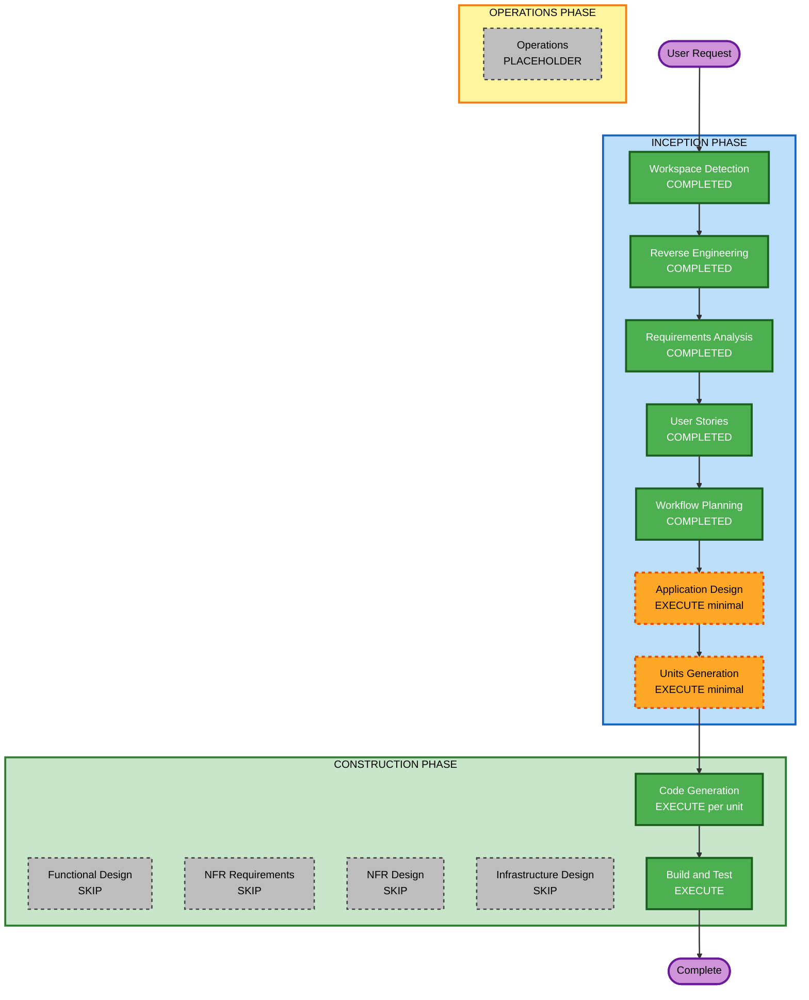

# Execution Plan — React SPA 化

## Detailed Analysis Summary

### Transformation Scope (Brownfield)

- **Transformation Type**: Architectural（プレゼンテーション層の分離 + API 契約の新設）
- **Primary Changes**: Blade SSR → React SPA、Web ルート → JSON API、セッション認証 → Sanctum SPA 認証
- **Related Components**:
  - `routes/web.php` / `routes/api.php` — ルート再編
  - Controllers（Auth / Payment / Order）— JSON レスポンス化
  - `resources/views/*` — Blade 削除、`app.blade.php` のみ残す
  - `resources/js/*` — React アプリ新設
  - `package.json` / `vite.config.js` — React + TS 依存追加
  - `bootstrap/app.php` / Sanctum 設定 — SPA 認証
  - **変更なし**: `PaymentService`, `StripeWebhookController`, Models, Migrations, Docker

### Change Impact Assessment

| 領域 | 影響 | 説明 |
|---|---|---|
| User-facing changes | **Yes** | 全画面が SPA 化。UX は同等機能を維持 |
| Structural changes | **Yes** | フロント/バックの責務分離（API + SPA） |
| Data model changes | **No** | `users` / `orders` スキーマ変更なし |
| API changes | **Yes** | 新規 JSON エンドポイント群。Webhook は維持 |
| NFR impact | **Low** | セキュリティ（CSRF/Sanctum）設定が主。Docker/DB は不変 |

### Component Relationships

- **Primary Component**: `laravel-payment-api/src`（Laravel モノリス）
- **Infrastructure Components**: `docker-compose.yml`, `docker/nginx` — 変更最小（SPA フォールバックのみ）
- **Shared Components**: `PaymentService`, Eloquent Models — 維持
- **Dependent Components**: React SPA（`resources/js`）→ API（`routes/api.php`）
- **Supporting Components**: Feature Tests（`tests/Feature`）— 新規追加

| コンポーネント | Change Type | Priority |
|---|---|---|
| API Routes + Controllers | Major | Critical |
| React SPA（resources/js） | Major（新規） | Critical |
| Blade Views | Major（削除） | Important |
| Sanctum / Session config | Minor | Critical |
| PaymentService / Webhook | None | — |
| Docker / Nginx | Configuration-only | Optional |

### Risk Assessment

- **Risk Level**: **Medium**
- **Rollback Complexity**: Moderate（feature ブランチで隔離、`feat/react-spa`）
- **Testing Complexity**: Moderate（API Feature tests + 手動 E2E）

**リスク要因**: Sanctum SPA + CSRF の設定ミス、認証ガードと API 401 の整合  
**軽減策**: Unit 1（auth-api）で API 単体検証 → Unit 2（spa + login）で統合確認の順序

### Module Update Strategy

- **Update Approach**: Sequential（API → SPA シェル → 画面 → クリーンアップ → テスト）
- **Critical Path**: auth API → SPA scaffold → login UI → payment/orders API → payment/orders UI
- **Coordination Points**: CSRF クッキー、Sanctum stateful domains、Stripe 公開キー API
- **Testing Checkpoints**: 各 Unit の Code Generation 完了時、最終 Build and Test

---

## Workflow Visualization



### Text Alternative

```
INCEPTION（完了）: Workspace Detection → Reverse Engineering → Requirements → User Stories → Workflow Planning
INCEPTION（実行）: Application Design (minimal) → Units Generation (minimal)
CONSTRUCTION（スキップ）: Functional Design, NFR Requirements, NFR Design, Infrastructure Design
CONSTRUCTION（実行）: Code Generation（5 Units）→ Build and Test
OPERATIONS: プレースホルダー
```

---

## Phases to Execute

### INCEPTION PHASE

| Stage | Status | Depth | Rationale |
|---|---|---|---|
| Workspace Detection | COMPLETED | — | 完了済み |
| Reverse Engineering | COMPLETED | — | 完了済み |
| Requirements Analysis | COMPLETED | — | 完了済み |
| User Stories | COMPLETED | — | 完了済み |
| Workflow Planning | COMPLETED | — | 本ドキュメント |
| **Application Design** | **EXECUTE** | **minimal** | API 境界・Sanctum 設定・React コンポーネント構成の整理。画面ワイヤーは不要 |
| Units Generation | **EXECUTE** | **minimal** | 5 Unit に分解しコミット戦略と対応 |

### CONSTRUCTION PHASE（Unit ごと）

| Stage | Status | Rationale |
|---|---|---|
| Functional Design | **SKIP** | 決済ビジネスロジックは既存。新規ロジックは薄い（API 化 + UI） |
| NFR Requirements | **SKIP** | 技術スタック・NFR は requirements.md で確定済み |
| NFR Design | **SKIP** | 新規 NFR パターンなし |
| Infrastructure Design | **SKIP** | Docker Compose 構成は維持 |
| **Code Generation** | **EXECUTE** | 各 Unit で実装（★ コードを書くフェーズ） |
| **Build and Test** | **EXECUTE** | ビルド・テスト手順の整備 |

### OPERATIONS PHASE

| Stage | Status |
|---|---|
| Operations | PLACEHOLDER |

---

## Units of Work（5 Units）

`commit-strategy.md` と `stories.md` に対応。

| Unit | 名称 | Stories | 想定コミット | 主な成果物 |
|---|---|---|---|---|
| **U1** | auth-api | US-001〜003 | #1 | `POST /api/login`, `POST /api/logout`, `GET /api/user`, Sanctum 設定 |
| **U2** | spa-foundation | US-011, US-001〜003 | #2, #3 | React+TS+Vite+Router+Tailwind, `app.blade.php`, Login, AuthGuard |
| **U3** | payment-orders-api | US-004〜005, US-007〜009 | #4 | payment/intent, orders, stripe config API |
| **U4** | spa-payment-orders | US-004〜009 | #5 | Payment, Success, OrderList ページ |
| **U5** | cleanup-tests-docs | US-010, US-011 | #6, #7, #8 | Blade 削除, Feature tests, README 更新 |

### Unit 実行順序（必須シーケンス）

```
U1 auth-api
  ↓
U2 spa-foundation（U1 に依存）
  ↓
U3 payment-orders-api（U1 に依存）
  ↓
U4 spa-payment-orders（U2 + U3 に依存）
  ↓
U5 cleanup-tests-docs（U1〜U4 完了後）
```

---

## Package Change Sequence

1. **Backend API 層**（U1, U3）— Controllers, routes/api.php, Sanctum config
2. **Frontend SPA 層**（U2, U4）— resources/js, package.json, vite.config.js
3. **統合・削除**（U5）— web.php フォールバック, Blade 削除, tests, README
4. **インフラ** — 変更なし（Nginx の SPA fallback のみ必要なら U2 で対応）

---

## Estimated Timeline

| フェーズ | ステージ数 | 目安 |
|---|---|---|
| INCEPTION 残り | 2（App Design + Units） | 1〜2 承認サイクル |
| CONSTRUCTION | 5 Units × Code Gen + Build/Test | 3〜5 セッション |
| **実装開始** | U1 Code Generation | Workflow Planning 承認 → App Design → Units 承認後 |

**Total**: あと **2 INCEPTION 承認** で最初のコード（U1 auth-api）に入れる。

---

## Success Criteria

### Primary Goal
Blade SSR から React SPA + JSON API へ移行し、ログイン → 決済 → 注文確認のユーザーフローを維持する。

### Key Deliverables
- React SPA（4 画面 + Router + Sanctum 認証）
- JSON API（auth / payment / orders / stripe config）
- Blade ビュー削除（`app.blade.php` のみ）
- API Feature tests（auth, payment intent, webhook）
- README 更新（SPA 版）

### Quality Gates
- [ ] `docker compose up` 後に SPA が表示される
- [ ] テストユーザーでログイン → 決済 → 注文確認が通る
- [ ] `php artisan test` がパス
- [ ] README と実装が整合
- [ ] 各 Unit 完了時点でアプリが破綻しない

### Integration Testing
- 手動 E2E: ログイン → PaymentIntent → Stripe テストカード → Webhook → 注文再取得
- 自動: Feature tests（API 層）

### Extension Compliance
| Extension | Status |
|---|---|
| Security Baseline | Disabled — N/A |
| Property-Based Testing | Disabled — N/A |
