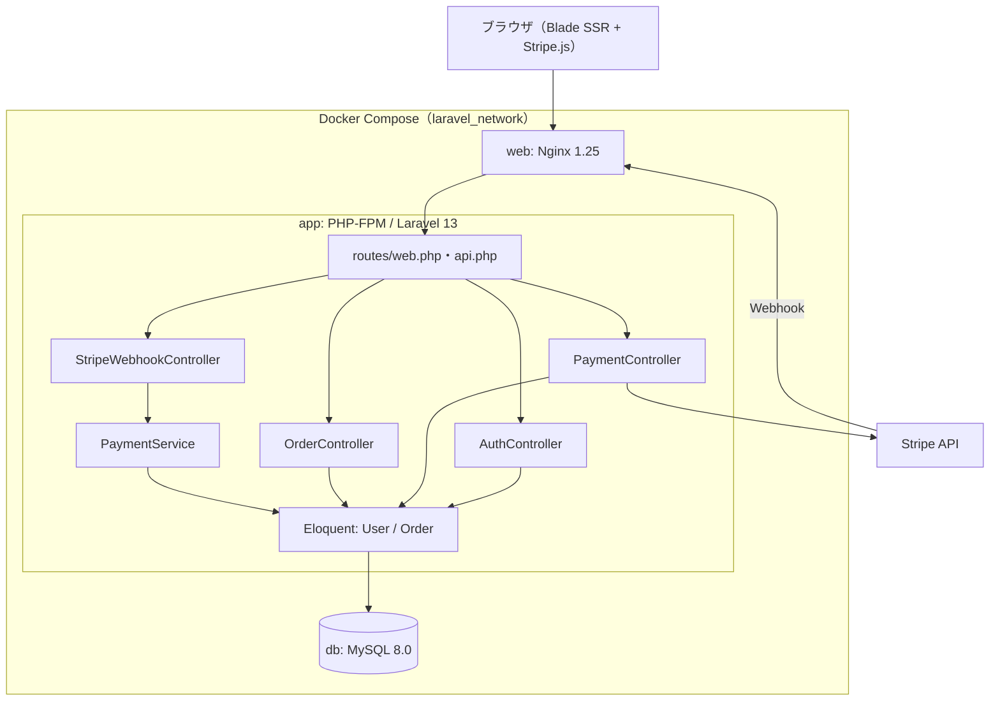
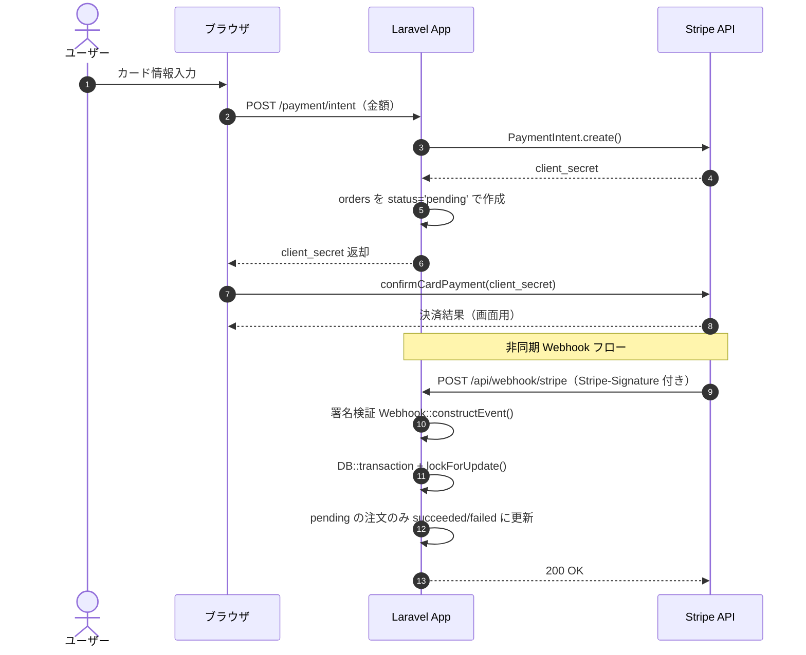

# System Architecture

## System Overview

Docker Compose で構成された Laravel モノリス。`web`（Nginx）・`app`（PHP-FPM / Laravel）・`db`（MySQL）の 3 コンテナを専用ネットワーク `laravel_network` で隔離している。現状のフロントエンドは **Blade による SSR（サーバーサイドレンダリング）** で、決済画面のみインライン JavaScript（Stripe.js）を用いる。認証は **Laravel 標準のセッション認証**。Stripe との連携は同期 API（PaymentIntent 作成）と非同期 Webhook（結果反映）に分離されている。

> 注: `laravel/sanctum` が導入され `routes/api.php` に `auth:sanctum` のサンプルルートが存在するが、現行の業務フロー（決済・注文）はセッション認証 + Blade で完結しており、Sanctum はトークン認証として実運用されていない。

## Architecture Diagram

## Component Descriptions

### AuthController
- **Purpose**: セッション認証。
- **Responsibilities**: ログイン表示・認証・セッション再生成・ログアウト。
- **Dependencies**: `Illuminate\Support\Facades\Auth`, セッション。
- **Type**: Application

### PaymentController
- **Purpose**: 決済開始（PaymentIntent 作成）。
- **Responsibilities**: フォーム表示、金額バリデーション、PaymentIntent 作成、`orders` の pending 作成、`client_secret` 返却。
- **Dependencies**: `Stripe\PaymentIntent`, `Order` モデル, `config('services.stripe')`。
- **Type**: Application

### OrderController
- **Purpose**: 注文一覧表示。
- **Responsibilities**: ログインユーザーの注文をページネーション取得しビューへ。
- **Dependencies**: `Order` モデル, `Auth`。
- **Type**: Application

### StripeWebhookController
- **Purpose**: Webhook 受信エントリーポイント。
- **Responsibilities**: 生ボディ取得・署名検証・イベント振り分け・レスポンス返却。
- **Dependencies**: `Stripe\Webhook`, `PaymentService`（コンストラクタ注入）, `Log`。
- **Type**: Application

### PaymentService
- **Purpose**: 決済ビジネスロジックの集約。
- **Responsibilities**: 状態遷移（succeeded/failed/refunded）、トランザクション + `lockForUpdate()`、冪等処理。
- **Dependencies**: `Order` モデル, `DB`, `Log`。
- **Type**: Application

### Eloquent Models（User / Order）
- **Purpose**: 永続化層。
- **Responsibilities**: `users`・`orders` テーブルへのマッピング。
- **Dependencies**: MySQL。
- **Type**: Model

## Data Flow

## Integration Points
- **External APIs**: Stripe API（PaymentIntent 作成）, Stripe.js（ブラウザでのカード決済確定）。
- **Databases**: MySQL 8.0（`users`, `orders`, および framework 標準テーブル）。
- **Third-party Services**: Stripe（Webhook 通知元）。

## Infrastructure Components
- **CDK Stacks**: なし（IaC は未導入）。
- **Deployment Model**: Docker Compose（app / web / db の 3 サービス）。
- **Networking**: 専用ブリッジネットワーク `laravel_network`。外部公開は Nginx（web）経由のみ、DB は外部非公開。
