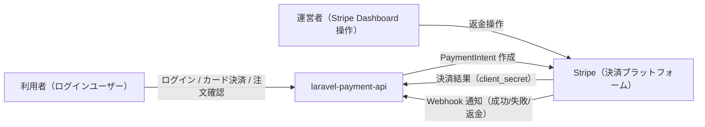

# Business Overview

## Business Context Diagram

## Business Description

- **Business Description**: 本システムは、ログイン済みユーザーがクレジットカードで支払いを行い、その決済結果を Stripe からの Webhook を通じて確実に注文ステータスへ反映する「カード決済連携アプリケーション」である。決済システム特有の課題（署名検証・冪等性・状態遷移・レースコンディション対策）を実務水準で扱うことを目的としたポートフォリオ作品。
- **Business Transactions**:
  - **ユーザー認証**: メールアドレス・パスワードによるセッションログイン／ログアウト。
  - **決済開始（PaymentIntent 作成）**: 金額を指定して Stripe に PaymentIntent を作成し、`orders` を `pending` で記録、`client_secret` をブラウザへ返却。
  - **決済確定**: ブラウザの Stripe.js がカード情報を Stripe に直接送信し決済を確定（カード情報は自社サーバーを経由しない）。
  - **決済結果反映（Webhook 処理）**: Stripe からの Webhook を署名検証し、`payment_intent.succeeded` / `payment_intent.payment_failed` / `charge.refunded` に応じて注文ステータスを冪等に更新。
  - **注文照会**: ログインユーザー本人の注文一覧を表示。
- **Business Dictionary**:
  - **Order（注文）**: 1 回の決済意図を表すレコード。金額・ステータス・Stripe の PaymentIntent ID を保持。
  - **PaymentIntent**: Stripe 側で決済の意図を表すオブジェクト。`client_secret` を介してブラウザで決済確定する。
  - **Webhook**: Stripe からサーバーへ送られる非同期の決済結果通知。署名（Stripe-Signature）付き。
  - **冪等性（Idempotency）**: 同一 Webhook が複数回届いても結果が一度しか反映されない性質。
  - **ステータス**: `pending` / `succeeded` / `failed` / `refunded` の 4 値で注文の状態を表す。

## Component Level Business Descriptions

### 認証（AuthController）
- **Purpose**: 利用者の本人確認とセッション管理。
- **Responsibilities**: ログイン画面表示、認証（`Auth::attempt`）、セッション再生成（固定化攻撃対策）、ログアウト時のセッション破棄。

### 決済フォーム（PaymentController）
- **Purpose**: 決済の起点。PaymentIntent を作成し決済を開始する。
- **Responsibilities**: 決済フォーム表示、金額バリデーション、PaymentIntent 作成、`orders` の `pending` 作成、`client_secret` 返却、完了画面表示。

### Webhook 受信（StripeWebhookController + PaymentService）
- **Purpose**: 決済結果の確定的な反映。
- **Responsibilities**: 署名検証、イベント振り分け（Controller）、状態遷移・ロック制御・冪等処理（Service）。

### 注文照会（OrderController）
- **Purpose**: ユーザーが自身の決済履歴を確認する。
- **Responsibilities**: ログインユーザーの注文のみをページネーション表示。
