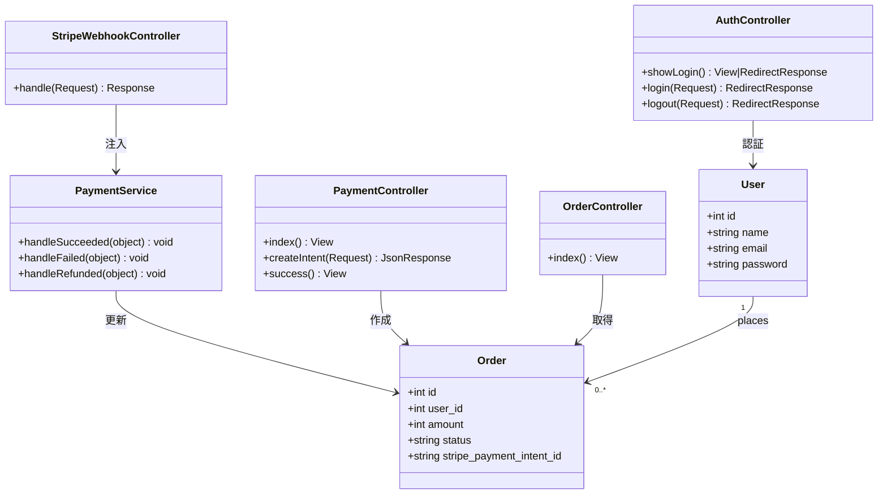

# Code Structure

## Build System
- **Type**: Composer（PHP 依存管理）+ npm / Vite（フロントアセット）。
- **Configuration**:
  - `src/composer.json`: Laravel 13、Sanctum、stripe-php、開発用に Pint・PHPUnit 等。`scripts.setup` で install → key:generate → migrate → npm build まで一括。
  - `src/package.json`: Vite 8 + Tailwind CSS 4。`build` / `dev` スクリプトのみ（現状 React 等の SPA フレームワークは未導入）。
  - `src/vite.config.js`: Laravel Vite プラグイン設定。

## Key Classes/Modules

### Existing Files Inventory
- `src/app/Http/Controllers/AuthController.php` - セッションログイン／ログアウト。
- `src/app/Http/Controllers/PaymentController.php` - 決済フォーム表示、PaymentIntent 作成、完了画面。
- `src/app/Http/Controllers/OrderController.php` - 注文一覧表示。
- `src/app/Http/Controllers/StripeWebhookController.php` - Webhook 署名検証・イベント振り分け。
- `src/app/Http/Controllers/Controller.php` - ベースコントローラー。
- `src/app/Services/PaymentService.php` - 決済ビジネスロジック・冪等性・状態遷移。
- `src/app/Models/Order.php` - 注文モデル（`fillable` 定義のみ）。
- `src/app/Models/User.php` - ユーザーモデル（Authenticatable）。
- `src/app/Providers/AppServiceProvider.php` - サービスプロバイダ（標準）。
- `src/routes/web.php` - 認証・決済・注文一覧ルート（SSR）。
- `src/routes/api.php` - Webhook ルート、Sanctum サンプル `GET /user`。
- `src/resources/views/auth/login.blade.php` - ログイン画面。
- `src/resources/views/payment/index.blade.php` - 決済フォーム（インライン Stripe.js）。
- `src/resources/views/payment/success.blade.php` - 決済完了画面。
- `src/resources/views/orders/index.blade.php` - 注文一覧画面。
- `src/resources/views/welcome.blade.php` - 標準ウェルカム（未使用に近い）。
- `src/resources/js/app.js` - Vite エントリ（最小）。
- `src/config/services.php` - Stripe キー設定（secret/public/webhook）。
- `src/config/sanctum.php`, `auth.php`, `session.php` - 認証・セッション設定。
- `src/database/migrations/*` - users / orders / cache / jobs / personal_access_tokens。
- `src/database/seeders/DatabaseSeeder.php` - テストユーザー（test@example.com）作成。
- `src/database/factories/UserFactory.php` - ユーザーファクトリ。
- `src/tests/Feature/ExampleTest.php`, `src/tests/Unit/ExampleTest.php` - 雛形テストのみ。

> **SPA 化で影響を受ける主なファイル**: `routes/web.php`・`routes/api.php`（API 化）、`PaymentController`・`OrderController`・`AuthController`（JSON レスポンス化／API 認証）、Blade ビュー群（React コンポーネントへ置換）、`resources/js`・`package.json`・`vite.config.js`（React ビルド構成）。`PaymentService`・`StripeWebhookController`・モデル・マイグレーションは原則そのまま再利用可能。

## Design Patterns

### Service Layer（Fat Controller 回避）
- **Location**: `PaymentService`。
- **Purpose**: Controller を「受け取り・検証・振り分け・返却」に限定し、DB 操作・状態遷移をサービスへ集約。
- **Implementation**: `StripeWebhookController` がコンストラクタインジェクションで `PaymentService` を受け取る。

### Dependency Injection
- **Location**: `StripeWebhookController::__construct`。
- **Purpose**: テスト時のモック差し替え。
- **Implementation**: Laravel DI コンテナによる自動解決。

### Idempotency + Pessimistic Locking
- **Location**: `PaymentService` の各ハンドラ。
- **Purpose**: Webhook 再送に対する二重処理防止・レースコンディション対策。
- **Implementation**: `DB::transaction` + `lockForUpdate()` + `status='pending'` 条件付き UPDATE、`stripe_payment_intent_id` の unique 制約。

### Event Dispatch（match 式）
- **Location**: `StripeWebhookController::handle`。
- **Purpose**: Stripe イベント種別ごとのサービスメソッド呼び分け。
- **Implementation**: PHP の `match` 式。

## Critical Dependencies

### stripe/stripe-php
- **Version**: ^20.1
- **Usage**: `PaymentController`（PaymentIntent 作成）、`StripeWebhookController`（署名検証）。
- **Purpose**: Stripe 決済連携の中核。

### laravel/framework
- **Version**: ^13.0
- **Usage**: ルーティング・Eloquent・認証・DB トランザクション全般。
- **Purpose**: アプリケーション基盤。

### laravel/sanctum
- **Version**: ^4.0
- **Usage**: `routes/api.php` のサンプル `auth:sanctum` ルートのみ（現状未活用）。
- **Purpose**: SPA 化時の API 認証候補。
