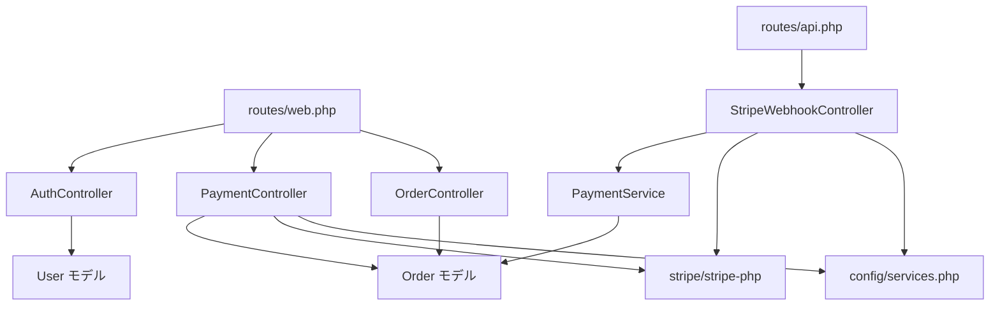

# Dependencies

## Internal Dependencies

### routes → Controllers
- **Type**: Runtime
- **Reason**: ルーティングが各コントローラーアクションへディスパッチ。

### StripeWebhookController → PaymentService
- **Type**: Runtime（コンストラクタ DI）
- **Reason**: 署名検証後のビジネスロジック委譲。

### PaymentController / StripeWebhookController → stripe/stripe-php
- **Type**: Runtime
- **Reason**: PaymentIntent 作成・Webhook 署名検証。

### Controllers / Service → Eloquent Models → MySQL
- **Type**: Runtime
- **Reason**: 注文・ユーザーの永続化。

## External Dependencies

### laravel/framework
- **Version**: ^13.0
- **Purpose**: フレームワーク基盤。
- **License**: MIT

### stripe/stripe-php
- **Version**: ^20.1
- **Purpose**: Stripe 決済 SDK。
- **License**: MIT

### laravel/sanctum
- **Version**: ^4.0
- **Purpose**: API トークン認証（SPA 化候補）。
- **License**: MIT

### laravel/tinker
- **Version**: ^3.0
- **Purpose**: REPL / デバッグ。
- **License**: MIT

### 開発依存（require-dev）
- phpunit/phpunit ^12.5（MIT）, mockery/mockery ^1.6（BSD-3-Clause）, fakerphp/faker ^1.23（MIT）, laravel/pint ^1.27（MIT）, laravel/pail ^1.2（MIT）, nunomaduro/collision ^8.6（MIT）。

### フロントエンド（npm devDependencies）
- vite ^8.0（MIT）, laravel-vite-plugin ^3.0（MIT）, tailwindcss ^4.0 + @tailwindcss/vite（MIT）, concurrently ^9.0（MIT）。
- Stripe.js（CDN: `https://js.stripe.com/v3/`）- ランタイムでブラウザ読み込み。
